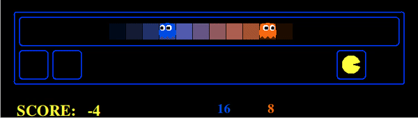

# AI-pacman-implementation
This repository contains all my implementations of AI algorithms in the Pacman game.

## Tracking :
In this part, Pacman is chasing invisible ghosts using Bayesian inference with data provided by its sensors.
### Exact inference :
First we assume that ghosts' positions are stationary, and Pacman updates its beliefs of the ghosts locations distribution using only sensors' data.
For each position in the grid, we update the agent' belief using the following equation :

Where :

 : Is the prior probability

 : Is the posterior probability

 : The probability of noisyDistance given the true distance to the position. It is given by the emission model

Given that all positions are equally likely in the beginning.
The results are given in the following captions ( The lighter the color, the higher the probability ) :

|  |  |
|:---:|:---:|
| First iterations : All positions are more or less equally likely | Later iterations : The beliefs dist. converges to the true one|

Because the error in the sensors data has a mean of zero, the belief's distribution is consistent.
Given that the sensors provide only information about the distance to the ghost, Pacman cannot decide which position the ghost is located in if the distance is the same.

As the ghost can only make one step at a time, the current position of the ghost can give us more information about its future position. Pacman can use it to get a better estimate of the ghost's location :

Combining data provided by the sensors and given older beliefs of the ghosts position, we can easily chase invisible ghosts using a greedy agent :

###Joint Particle filtering

If the space of ghosts positions is very large, e.g a large grid or a continuous space, exact inference can be very costly computionally and timely speaking. That is why we can use particle filtering as a mean to approximate the original distribution.
 
Particle filtering consists basically of using particles and sampling to approximate the probability distribution rather than calculating the exact inference. This is done in three stages :
 
**Time Elapse** : We move particles from current positions to future positions based on the transition model
 
**Weighting** : We weight based on the evidence provided by the sensors
 
**Resampling**: We resample using the previous weights to create new particles

The space complexity is reduced to storing particles rather than states, while the time complexity is linear in the number of particles.

Because the positions of ghosts can be dependent, we use the joint distribution of the ghosts positions using dynamic Bayes net :

Pacman can now easily keep track of every invisible ghost :

